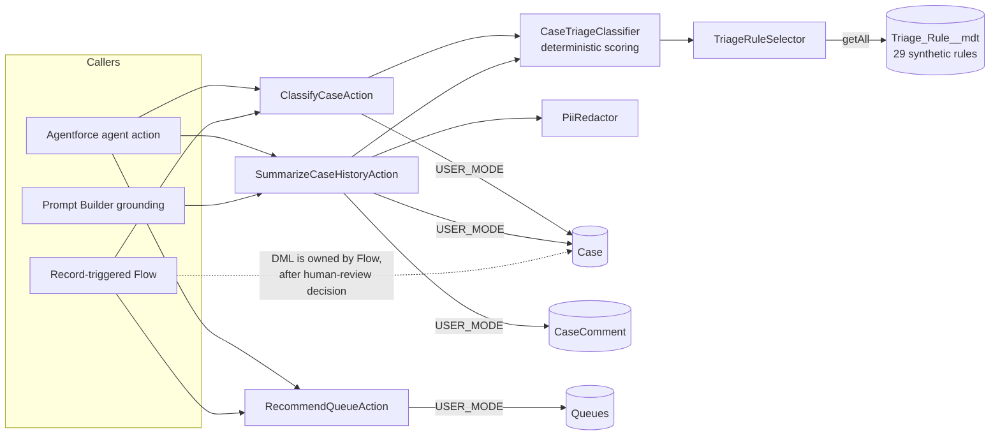

# Agentforce Case Triage Actions

Bulk-safe `@InvocableMethod` Apex actions that classify a case, summarise its history into a PII-redacted structured payload, and recommend the next-best queue. They are built to be used from Flow and as Agentforce agent actions.

> **Disclaimer:** Representative portfolio project built independently with synthetic data. It is not code from any employer or client.
>
> **The classification logic is deterministic and for demonstration.** It scores synthetic keyword rules. It is not a machine-learning model and does not call an LLM.

## Business use case

Contact centres serving banking and healthcare members receive mixed queues of fraud reports, card disputes, login problems, medical-billing questions and appointment changes. Triage by hand is slow and inconsistent, and generative AI can only be adopted safely when:

- the inputs to an agent or prompt contain **no personal data**;
- the recommendations can be **explained** and **reproduced**;
- a **person stays in control** of any change to a record.

These three actions give an agent (human or Agentforce) a transparent first pass. Each one returns a recommendation; none of them writes to the database.

| Action | Label | Output |
| --- | --- | --- |
| `ClassifyCaseAction` | Classify Case (Deterministic) | category, urgency, confidence (0 to 1), matched keywords, requires-human-review flag, rationale |
| `SummarizeCaseHistoryAction` | Summarize Case History | `summaryJson` (structured, redacted), `plainTextSummary`, comment count, age in days |
| `RecommendQueueAction` | Recommend Case Queue | queue Id / developer name / name, reason, fallback flag |

## What needs Agentforce, and what does not

| Works in any org (including a plain scratch org) | Needs an Agentforce / Einstein generative AI enabled org |
| --- | --- |
| Deploying all metadata, running Apex tests | Registering the Apex actions as **agent actions** in Agent Builder |
| Calling the actions from **Flow** (`docs/flow-design.md`) | Building the **Prompt Builder** template in `docs/prompt-template-case-triage-summary.md` |
| Calling the actions from Apex or the REST Actions API | Einstein Trust Layer settings (masking, zero data retention, audit) |

The `docs/` files are **documentation and designs only**. No agent, topic, prompt template or Flow is deployed by this repository, and no generative output is claimed.

## Architecture



### Classification algorithm (deterministic)

1. Normalise `subject + description`: lower-case, strip punctuation, collapse whitespace.
2. For each active `Triage_Rule__mdt` keyword that matches **on word boundaries**, add `Category_Weight__c` to that category and `Urgency_Weight__c` to the urgency score.
3. **Category** is the highest score. Ties go to a fixed priority order (Fraud, Card Dispute, Account Access, Patient Billing, Appointments, Loan Servicing). No match gives `General`.
4. **Urgency**: score of 5 or more is Critical, 3 or more is High, 1 or more is Medium, otherwise Low. Fraud is never below High.
5. **Confidence** is the winning category's points divided by all category points (two decimals).
6. **Requires human review** when the category is `General`, confidence is below 0.6, or urgency is `Critical`.

The rationale lists only rule keywords, never case text. The same input always gives the same output.

### Queue recommendation

Each category maps to a queue (`Fraud_Response`, `Card_Disputes`, `Digital_Banking_Support`, `Lending_Services`, `Patient_Billing`, `Care_Coordination`, `General_Support`). Critical urgency outside Fraud goes to `Priority_Escalations`. If the preferred queue is missing, the action falls back to `General_Support` and sets `fallbackUsed = true`. All queues are shipped as metadata.

## Guardrails

**No PII in prompts**
- `SummarizeCaseHistoryAction` never queries Contact or Account names, emails or phone numbers. Its payload is a typed allow-list (`SummaryPayload`).
- Every free-text excerpt (subject, comments) passes through `PiiRedactor`, which replaces emails, phone numbers, 13 to 19 digit card-like numbers, SSN-like and MRN-like values, and dates with tokens such as `[EMAIL]`. Excerpts are capped at 280 characters.
- Classification output contains rule keywords only.
- Redaction is best-effort defence in depth. It is not a substitute for data minimisation or the Trust Layer.

**Einstein Trust Layer**
- When these actions are used by an agent or a prompt template, the platform's Trust Layer (data masking, zero data retention with the model provider, toxicity detection, audit trail) should be enabled and reviewed by the org's admins. This repository does not configure it.

**Human in the loop**
- All actions are **read-only**. They return recommendations, and record changes happen only in the calling Flow or through an agent user acting on a person's instruction.
- `requiresHumanReview` is computed deterministically and is meant to block auto-routing (see `docs/flow-design.md`).
- Failures (case not found, no input) return `isSuccess = false` with a message instead of throwing, so agents and Flows can route to a person.

**Least privilege**
- `Case_Triage_Agent` grants access to the three Apex classes, `Triage_Rule__mdt` and the five triage fields only. Every query is `WITH USER_MODE`.

## Tech stack

Apex (API 62.0) invocable actions, Custom Metadata Types, Queues, Permission Sets, Flow (design), Agentforce / Prompt Builder (documented integration points), Prettier, Salesforce Code Analyzer v5, GitHub Actions.

## Project structure

```
agentforce-case-triage-actions/
├── .github/workflows/ci.yml
├── config/project-scratch-def.json
├── data/                                   # synthetic Cases + CaseComments tree plan
├── docs/
│   ├── agentforce-setup.md                 # agent actions/topic guidance (not deployed)
│   ├── flow-design.md                      # record-triggered Flow design (not deployed)
│   └── prompt-template-case-triage-summary.md
├── force-app/main/default/
│   ├── classes/                            # 3 actions, classifier, redactor, selector + tests
│   ├── customMetadata/                     # Triage_Rule.* (29 synthetic keywords)
│   ├── objects/
│   │   ├── Case/fields/                    # AI_Category__c, AI_Urgency__c, AI_Confidence__c, Needs_Human_Review__c, Triage_Rationale__c
│   │   └── Triage_Rule__mdt/
│   ├── permissionsets/Case_Triage_Agent.permissionset-meta.xml
│   └── queues/                             # 8 Case queues
├── code-analyzer.yml
└── package.json
```

## Setup

```bash
sf org login web --set-default-dev-hub --alias devhub
sf org create scratch --definition-file config/project-scratch-def.json --alias triage --set-default --duration-days 7
sf project deploy start --target-org triage
sf org assign permset --name Case_Triage_Agent --target-org triage
sf data import tree --plan data/sample-data-plan.json --target-org triage
sf apex run test --target-org triage --test-level RunLocalTests --code-coverage --result-format human --wait 20
```

Try an action from anonymous Apex:

```apex
ClassifyCaseAction.Request r = new ClassifyCaseAction.Request();
r.subject = 'Stolen card';
r.description = 'Synthetic member reports suspicious charges, urgent';
System.debug(JSON.serializePretty(ClassifyCaseAction.classify(new List<ClassifyCaseAction.Request>{ r })));
```

To use the actions with Agentforce, use an org where Agentforce is enabled and follow `docs/agentforce-setup.md`. The scratch definition here does not turn on generative AI features. Add the features listed in the current Salesforce scratch-org documentation if your Dev Hub is entitled to them.

## Local checks

```bash
npm ci
npm run prettier:verify
sf code-analyzer run --config-file code-analyzer.yml --workspace . --target force-app --rule-selector Recommended
```

This repository has no JavaScript, so there is no Jest suite.

## Synthetic sample data

`data/Cases.json` has five fictional cases (fraud, dispute, medical billing, appointment, general) and `data/CaseComments.json` has two comments. All the text is invented and marked "Synthetic".

## Configuration template

Add or tune rules without code. Each rule is one `Triage_Rule__mdt` record:

```xml
<CustomMetadata xmlns="http://soap.sforce.com/2006/04/metadata"
    xmlns:xsi="http://www.w3.org/2001/XMLSchema-instance" xmlns:xsd="http://www.w3.org/2001/XMLSchema">
    <label>Overdraft</label>
    <protected>false</protected>
    <values><field>Keyword__c</field><value xsi:type="xsd:string">overdraft</value></values>
    <values><field>Category__c</field><value xsi:type="xsd:string">Card Dispute</value></values>
    <values><field>Category_Weight__c</field><value xsi:type="xsd:double">2.0</value></values>
    <values><field>Urgency_Weight__c</field><value xsi:type="xsd:double">0.0</value></values>
    <values><field>Is_Active__c</field><value xsi:type="xsd:boolean">true</value></values>
</CustomMetadata>
```

Leave `Category__c` blank for urgency-only words (for example `urgent`, `emergency`). Thresholds (`REVIEW_CONFIDENCE_THRESHOLD`, urgency cut-offs) and the category-to-queue map are constants in `CaseTriageClassifier` and `RecommendQueueAction`.

## Testing approach

| Test class | Focus |
| --- | --- |
| `CaseTriageClassifier_Test` | Fraud scoring and Critical urgency, fraud floor, healthcare billing, whole-word matching, tie-breaks and confidence maths, urgency thresholds, shipped rule set end to end |
| `ClassifyCaseAction_Test` | **200-case bulk** call with one SOQL query, explicit text overriding stored text, free-text mode without a query, error results instead of exceptions |
| `SummarizeCaseHistoryAction_Test` | Comment limit, total count, **PII redaction in JSON and plain text**, multiple cases with three queries total, closed cases, missing Ids |
| `RecommendQueueAction_Test` | Category mapping against deployed queues, critical escalation, fallback, one query per batch |
| `PiiRedactor_Test` | Email, phone, card, SSN, MRN and date patterns (synthetic fixtures), no false positives on short numbers |

Tests run as a Standard User with `Case_Triage_Agent`. Rules are injected through `TriageRuleSelector.mockRules`, so results do not change when the shipped metadata is tuned.

> Apex tests need an org. They run in the optional CI scratch-org job.

## Continuous integration

1. **static-checks:** `npm ci`, Prettier check, and Salesforce Code Analyzer (fails on High or Critical findings, HTML report uploaded).
2. **scratch-org-validate (optional):** only when the `SFDX_AUTH_URL` secret exists. It deploys to a scratch org, runs Apex tests, and deletes the org.

## Limitations and future enhancements

- Keyword rules are English-only, have no stemming, and do not understand negation ("not fraud" still matches `fraud`).
- Confidence is a share of evidence, not a calibrated probability.
- Redaction is pattern-based and will miss some free-form personal data.
- Possible additions: an Apex-grounded Prompt Builder resource, Einstein-based classification behind the same action interface (keeping the deterministic one as a fallback), feedback capture to tune rule weights, multi-language keyword sets, and a deployable, tested Flow.

## License

[MIT](LICENSE). Copyright (c) 2026 Vanaja Kumari.
