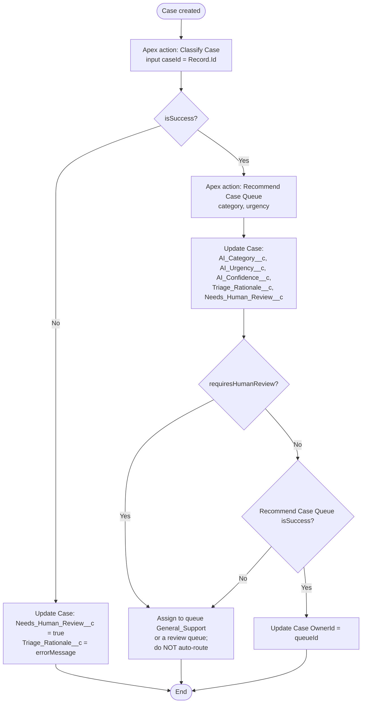

# Flow-ready design: "Case - Triage on Create" (design document)

This is a **design**, not a deployed Flow. Hand-written Flow XML is brittle, so
the recommended path is to build it in Flow Builder from this specification,
then retrieve it (`sf project retrieve start --metadata Flow:Case_Triage_On_Create`).

## Trigger

- Record-triggered Flow on **Case**, *A record is created*.
- Optimise for **Actions and Related Records** (after save).
- Entry condition: `Origin` is not `Internal` (example). Run asynchronously
  ("Run Asynchronously" path) so triage never slows down case creation.

## Steps

## Variable mapping

| Action output | Case field |
| --- | --- |
| Classify Case > Category | `AI_Category__c` |
| Classify Case > Urgency | `AI_Urgency__c` |
| Classify Case > Confidence | `AI_Confidence__c` |
| Classify Case > Rationale | `Triage_Rationale__c` |
| Classify Case > Requires Human Review | `Needs_Human_Review__c` |
| Recommend Case Queue > Queue Id | `OwnerId` (only when no review is required) |

## Notes

- All three Apex actions are **read-only**. The Flow owns every DML, so record
  changes are visible in Flow debug logs and can be paused or reviewed.
- The actions are bulkified: a Flow interview batch of 200 cases results in one
  SOQL query per action.
- The running user (or the Automated Process user for async paths) needs the
  `Case_Triage_Agent` permission set.
